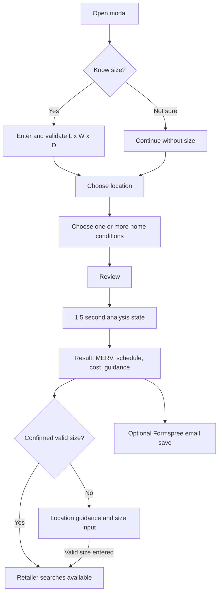

# Filter Finder

Last verified: 2026-07-19

The Finder exists only on [`../index.html`](../index.html). Entry points include the hero CTA, inline Finder CTA, navigation/anchor links, article links to `/#filter-finder`, and restart controls. [`../assets/js/script.js`](../assets/js/script.js) controls it.

This file owns the user journey and interaction contract. Exact recommendation math belongs to [`FILTER_LOGIC.md`](FILTER_LOGIC.md), retailer eligibility/link rules to [`AFFILIATE.md`](AFFILIATE.md), event semantics to [`ANALYTICS.md`](ANALYTICS.md), and acceptance testing to [`TESTING.md`](TESTING.md).

## Steps and validation

1. `Yes, I know it` or `Not sure`. Known-size requires a realistic three-part size; selecting `Not sure` clears size state.
2. Ceiling return, wall return, furnace/air handler, or unknown location.
3. Pets, allergies, heavy dust, kids, or mutually exclusive `None of these`; at least one selection required.
4. Review and generate.

Back is disabled on step one; Next validates before advancing. The modal closes by button, overlay, or Escape, traps Tab focus, restores focus to its opener, and restores body scrolling. Option buttons use `aria-pressed`; progress and analysis states use live regions.

## Results and state

Results include size/confidence, MERV display/caution, schedule, next month, reminder months, yearly estimate, product illustration, personalized insight, disclosures, copy action, optional email, and retailer cards only after confirmation. Unknown users see location-specific guidance and can update the same report with a valid size.

Local storage keys: `filterWizardFinderResults` stores the latest report; `filterWizardEmailSignups` stores the latest submitted email/source/timestamp; `filterWizardConsent` stores consent. This is device-local, not an account.

Errors cover missing choices, invalid dimensions, missing conditions, failed images, failed email submission, and unavailable clipboard access. See [`ANALYTICS.md`](ANALYTICS.md) for events.

## Journey invariants

- A user can obtain educational guidance without knowing a size.
- A retailer path appears only after a size passes the current three-dimension parser and is explicitly confirmed.
- “High confidence” means selected from the internal common-size list, not verified physical fit.
- Back/restart/close must not trap users or silently convert an unknown size into a confirmed one.
- Results explain uncertainty and never imply equipment inspection, diagnosis, guaranteed compatibility, or guaranteed reminders.

Change questions or branching only with a mapped before/after journey, impact on stored state and analytics, migration behavior for old local-storage values, and known/unknown branch regression tests.

## Approved future opportunities

Not implemented: explicit thickness question, HVAC runtime, primary filtration goal, scheduled reminders, multiple-home/filter profiles, durable annual-cost history, change history, photo-assisted recognition, and HVAC-model lookup. Any photo/model feature must disclose uncertainty and never claim physical compatibility without confirmation.

Update this file when: questions, branching, modal behavior, result order, storage, errors, or entry points change.
